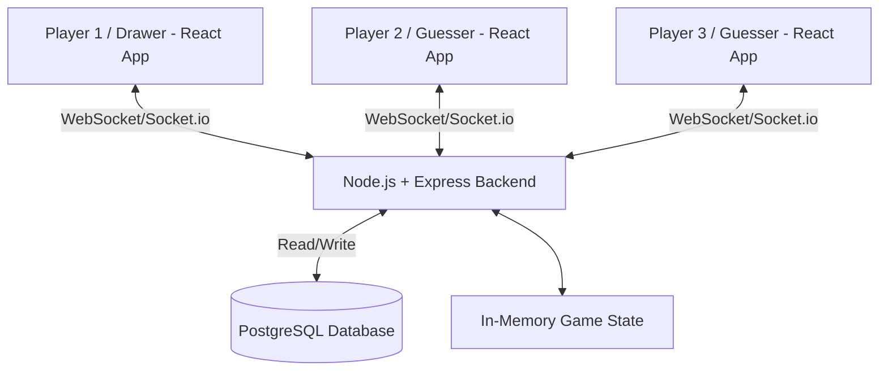
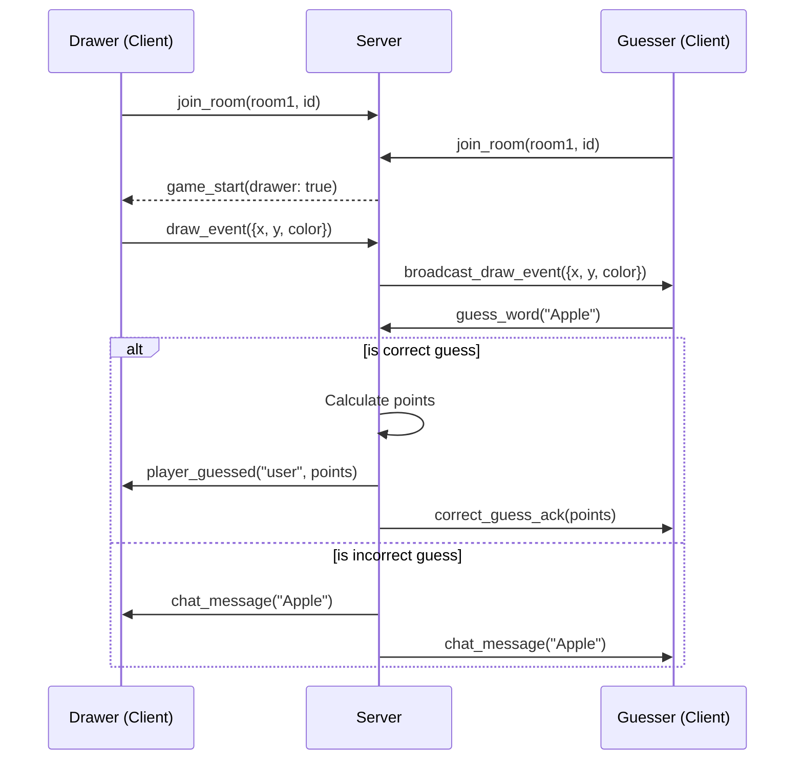

# Scribble 🎨

Scribble is a real-time multiplayer drawing and guessing game (Pictionary-style) built with the PERN/MERN stack concepts (currently using **React**, **Node.js**, **Express**, and **Socket.io**).

Players can create or join rooms, take turns drawing words, and guess what others are drawing in real-time to earn points.


## 🚀 Features

- **Real-time Collaboration**: Instant drawing updates across all clients using Socket.io.
- **Game Rooms**: Create private rooms to play with friends.
- **Game Logic**:
  - Turn-based drawing system.
  - Word selection (3 options).
  - Scoring system based on speed and accuracy.
  - Real-time leaderboard.
- **Chat System**: Integrated chat for guessing and communication.
- **Responsive Design**: Works on desktop and tablets.

## 🛠️ Tech Stack

- **Frontend**: React.js, Socket.io-client, CSS3
- **Backend**: Node.js, Express, Socket.io
- **State Management**: In-memory (Game state managed on server)

## 📦 Installation & Setup

### Prerequisites

- [Node.js](https://nodejs.org/) (v14 or higher)
- [Git](https://git-scm.com/)

### 1. Clone the Repository

```bash
git clone https://github.com/shivam543210/scribble.git
cd scribble
```

### 2. Backend Setup

Navigate to the backend directory and install dependencies:

```bash
cd scribble-backend
npm install
```

Start the backend server:

```bash
npm start
# Server runs on http://localhost:5000 (default)
```

### 3. Frontend Setup

Open a new terminal, navigate to the frontend directory and install dependencies:

```bash
cd scribble-frontend
npm install
```

Start the React development server:

```bash
npm start
# App runs on http://localhost:3000
```

## 🎮 How to Play

1.  Open the app in your browser.
2.  Enter a username and create a room (or join an existing one).
3.  Share the Room ID with friends.
4.  Once everyone handles joined, the host can **Start Game**.
5.  **Drawer**: Choose a word and draw it on the canvas.
6.  **Guessers**: Type your guess in the chat box. Correct guesses turn green!
7.  The player with the most points after all rounds wins!

## 🏛️ System Architecture

### High-Level Design (HLD)
graph TD

    Users[Clients (React App)]
    
    Users -->|WebSocket| LB[Load Balancer (NGINX)]

    LB --> S1[Socket Server 1 (Node.js)]
    LB --> S2[Socket Server 2 (Node.js)]
    LB --> S3[Socket Server N (Node.js)]

    S1 -->|Pub/Sub| R[(Redis)]
    S2 -->|Pub/Sub| R
    S3 -->|Pub/Sub| R

    S1 --> DB[(PostgreSQL)]
    S2 --> DB
    S3 --> DB

Scribble uses a classic Client-Server Architecture optimized for real-time bidirectional communication.



- **Frontend (Client):** Developed in React. Handles rendering the drawing canvas, real-time chat, and game UI. Establishes a persistent full-duplex WebSocket connection via Socket.io.
- **Backend (Server):** Node.js and Express server that serves API endpoints and hosts the Socket.io server. It acts as the central hub, receiving drawing events from the active drawer and broadcasting them to all other clients in the same room.
- **State Management:** Time-critical data like current drawer, stroke coordinates, and timer are maintained in-memory on the backend for minimal latency.
- **Database:** PostgreSQL is used for persisting user records, historical scores, and room metadata.

### Low-Level Design (LLD)

#### Core Components & Flow

1.  **Connection & Room Management**
    - `socketManager`: Listens for `join_room` events, maps Socket IDs to users, and manages Socket.io rooms.
    - When a user joins, they are added to a `Room` object in the backend's in-memory state.
2.  **Drawing Synchronization Pipeline**
    - The `Canvas` component captures `onMouseMove` events.
    - Emits a `draw_stroke` event containing `(x, y, color, size)` to the backend.
    - The backend selectively broadcasts this event to `room.clients` (excluding the sender).
    - Receiving clients parse the stroke data and update their HTML5 `<canvas>`.
3.  **Game Loop & Scoring Engine**
    - A server-side game loop ticks every second, broadcasting `time_update` events.
    - When the Drawer selects a word, it's stored in the server's `GameState`.
    - Users submit guesses via the `Chat` component (`chat_message` event).
    - The backend intercepts the message. If it matches the hidden word:
      - The user is awarded points based on the remaining time.
      - A `player_guessed_correctly` event is broadcasted.
    - If it does not match, a standard `new_chat_message` is broadcasted.



## 🤝 Contributing

Contributions are welcome! Please fork the repository and create a pull request.

## 📄 License

This project is licensed under the ISC License.
